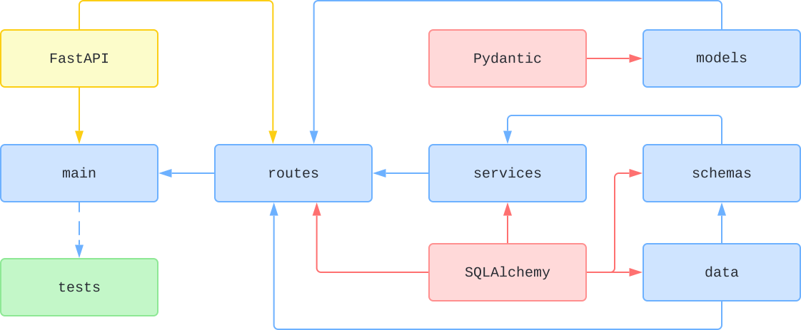

<div align="center" >
  
  <h1>
    uTest v1.0.0 👋
  </h1>
</div>

<p align="center" >
  <a href="">
      
  </a>
  <a href="https://fastapi.tiangolo.com">
      
  </a>
  <a href="https://docs.pydantic.dev/2.4/">
      
  </a>
  <a href="https://www.mysql.org">
      
  </a>
  <a href="https://redis.io">
      
  </a>
  <a href="https://docs.docker.com/compose/">
      
  </a>
  <a href="https://nginx.org/en/">
      
  </a>
</p>

> #### 缓慢开发功能...

### 🎉 技术栈

- ⚡️ **Fully Async**
- 📚 **SQLAlchemy 2.0**
- 🚀 **Pydantic V2**
- 🦾 **Powerful CRUD Functionality**
- 🔐 **User authentication with JWT**
- 🚚 **Easy running with docker compose**

### 🏬 架构

<div align="center" >
    
</div>

_图：简化的概念性项目结构和主要应用程序流。并非所有依赖项都显示。_

### 🛠️ 开发环境

| 工具/组件 | 版本要求         |
| --------- | ---------------- |
| Python    | \>= 3.10         |
| FastAPI   | 最新稳定版       |
| Pydantic  | v2.x             |
| MySQL     | 8.x              |
| Redis     | \>= 6.0          |
| Docker    | 可选（用于部署） |

### 📁 结构

```
utest/
├── app/ # 核心应用代码
│ ├── api/ # API 路由定义
│ │ ├── v1/ # API 版本控制（v1）
└── ...
├── docs/ # 文档资源
├── requirements.txt # Python 依赖列表
├── Dockerfile # Docker 构建文件（可选）
├── docker-compose.yml # 多服务部署编排文件
└── main.py # 应用启动文件
```

### 🏁 本地启动

```bash
pip install -r requirements.txt

uvicorn app.main:app --host 0.0.0.0 --port 8000 --reload
```
